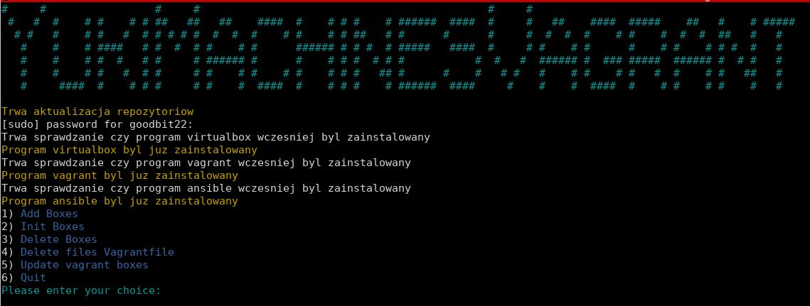

# Inflastructure-vagrant

A configuration that creates twelve virtual machines using Vagrant, Virtualbox, bash scripts and Ansbile.

## Description

Infrastructure project for vulnerability testing of operating systems

The project consists of Vagrantfile and Ansible playbooks

1. **vagrantfile** - there are ten virtual machines in it
2. **metaspoloitab3/Vagrantfile** - includes two virtual machines
3. **playbooks/start_*.yml** - are running when the virtual machines is created
4. **playbooks/kali.yml** - playbook installing additional python scripts, packages and creating a dictionary

**Windows systems:**

* Win 8.1
* Win 7
* Win server 2016
* Win 10

**Linux systems:**

* Kali Linux
* Ubuntu 21.10
* Fedora 33
* Metasploitable2
* Metasploitable3-linux
* Metasploitable3-win
* Redstar OS

**Unix systems:**

* Solaris 11_3

In addition, three scripts were created. Two scripts allow your manange Vagrant box and  already created virtual machines. Script three creates malicious files using msfvenom

### **ArielRunVagrant.sh** - script to manage already created virtual machines


### **YukiMachinesVagrant.sh** - script to manage Vagrant boxes



### **Alucard.sh** - script that is used to create malicious files using msfvenom


## Table of Content

* [Description] (#description)
* [Features](#feature)
* [Technologies](#tech)
* [Running](#run)
* [Author](#aut)

## Features

### **ArielRunVagrant.sh**

* Run virtual machines
* Switch off virtual machines  
* Save status virtual machines
* Remove virtual machines  
* Switch network interfaces on internal network
* Switch network interfaces on host-only  
* Switch network interfaces on bridge

### **YukiMachinesVagrant.sh**

* Add Boxes
* Init Boxes
* Delete Boxes
* Delete files Vagrantfile
* Update vagrant boxes

### **Alucard.sh**

* Generating an infected Windows applications
* Generating an infected Linux applications
* Generating an infected Unix applications

## Technologies

* Bash
* Ansible
* Vagrant
* VBoxManage

## Running

```Ansible
    ansible-playbook -i  .vagrant/provisioners/ansible/inventory/vagrant_ansible_inventory playbooks/kali.yml
```

```sh
    bash ArielRunVagrant.sh
    bash YukiMachinesVagrant.sh
    bash attack_systems_scripts/Alucard.sh 
```

or

```sh
    ./ArielRunVagrant.sh
    ./YukiMachinesVagrant.sh
    attack_systems_scripts/./Alucard.sh 
```

## Author

*****
**goodbit22** --> "https://github.com/goodbit22"
*****
